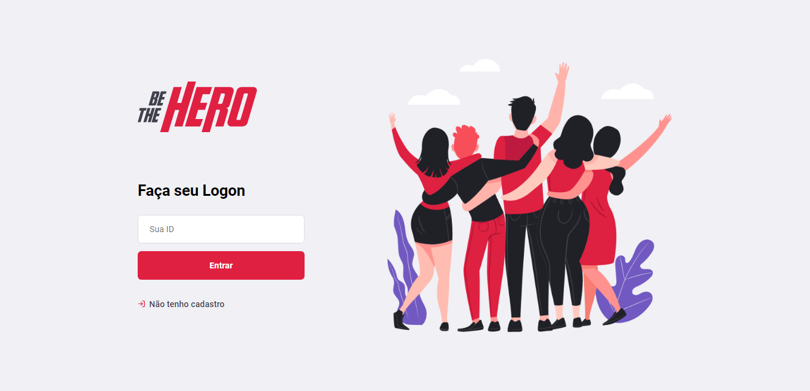

# Be The Hero



## Overview

Application developed during the week OmniStack 11, in which the focus of the application is to connect third sector entities to people who are willing to help.


- Node.js ✨;
- React.js 📝;
- Knex 🗃;
- SQL 🗒;
- React Native 📱;


## Get Started
1. Clone this repository:

    ```shell
    $ git clone https://github.com/JuanFelix88/be-the-hero.git
    ```

2. Install backend and front-end dependencies and run initial structure migrations in dev-database:

    ```shell
    $ cd backend
    $ yarn install
    $ yarn knex migrate:latest
    $ cd ../frontend
    $ yarn install
    ```

3. And then turn the two controls simultaneously as shown below:

    In the folder backend:
    ```shell
    $ yarn dev
    ```

    In the folder frontend:
    ```shell
    $ yarn start
    ```

4. Access the url http://localhost:3000/ and enjoy the application!
